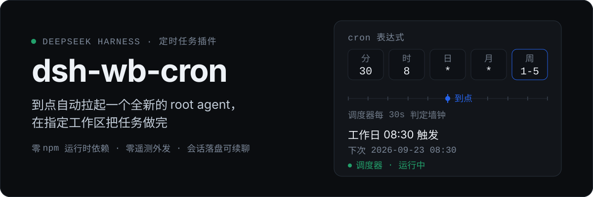
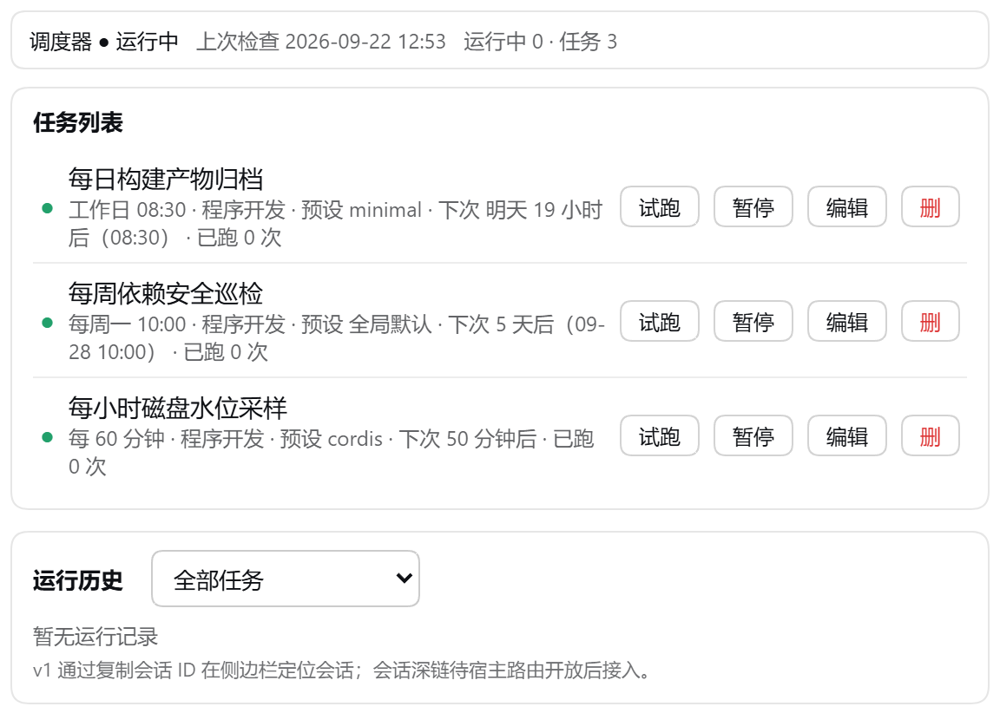
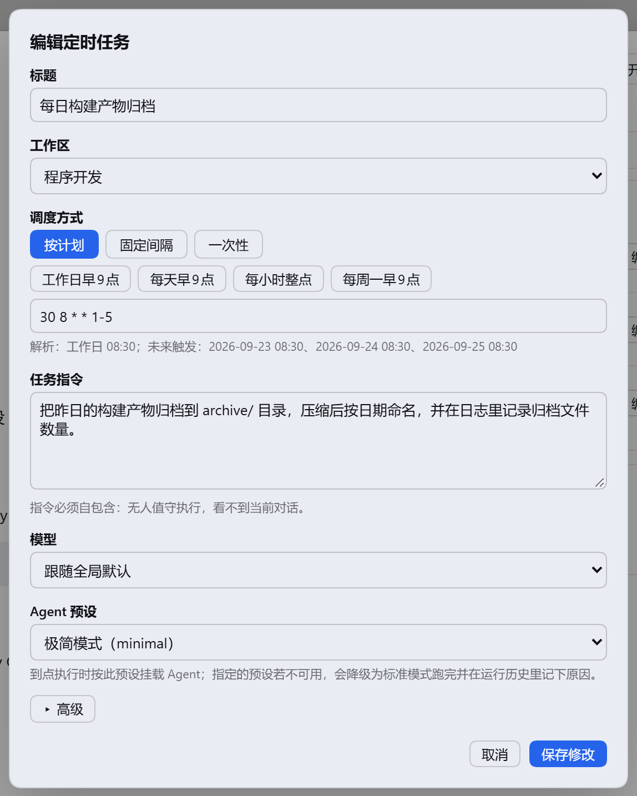
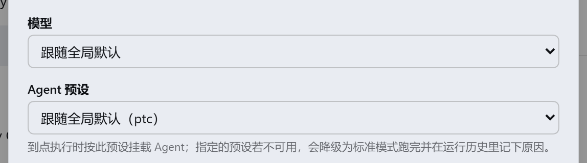
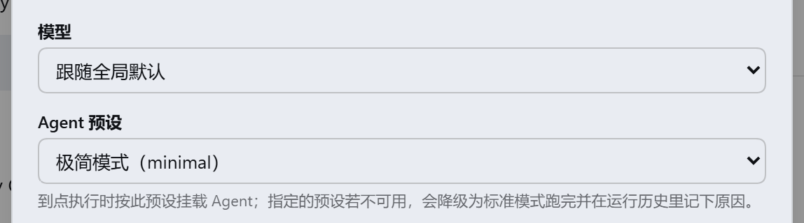
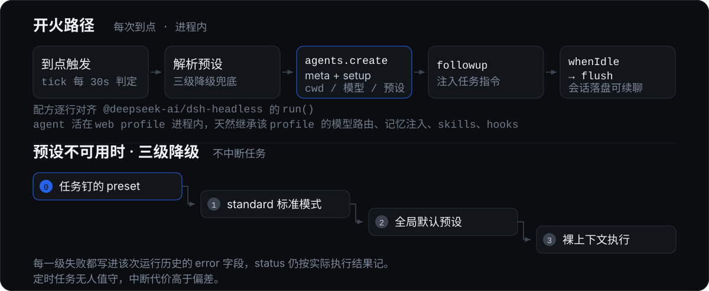

<p align="center">
  
</p>

**DeepSeek Harness 的无人值守定时任务插件。** 到点自动在 web profile 进程内拉起一个全新的 root agent，在指定工作区自主执行你的任务指令；会话正常落盘，可回 Web 侧边栏续聊。不需要子进程，不需要单独凭据，零 npm 运行时依赖，也不向任何外部地址发送统计或心跳——唯一的网络行为是你在任务指令里让 agent 做的事。

- **三种调度形态**——5 字段 cron 表达式（支持步长/区间/列表/英文名/Vixie OR 语义/IANA 时区）· 固定间隔（≥5 分钟）· 一次性绝对时刻（创建时锚定，绝不漂移）。
- **对话式管理**——`cron_create` / `cron_list` / `cron_update` / `cron_delete` / `cron_run_now` / `cron_next` / `cron_history`，直接说「每天早上 9 点帮我跑 X」即可。
- **两级 GUI**——主界面左下角速览入口（运行角标 + 浮层面板）+ 设置页完整管理卡片（CRUD / 新建编辑对话框 / 运行历史 / cron 实时预览）。

## 界面预览

| 侧边栏速览 | 设置 → 定时任务 |
|---|---|
|  |  |

编辑对话框里，**Agent 预设**就在「模型」下方，每个任务可以各自钉住 standard / ptc / minimal / cordis 或任意用户自建预设；列表行也会显示当前钉的预设。



新建任务默认「跟随全局默认」，也可以直接钉住某个预设：

| 跟随全局默认（当前全局为 ptc） | 钉住「极简模式（minimal）」 |
|---|---|
|  |  |

> 截图为演示数据。预设下拉的内容与「跟随全局默认」括号里的 id 都来自宿主当前实际安装的预设（`GET /dsh-wb-cron/presets`）。

## 它和内置的 dsh-schedule 怎么分工

| | 触发场景 | 会话关闭后 |
|---|---|---|
| `schedule_create`（宿主内置） | 会话内提醒 | 提醒一直逾期，等会话回来 |
| `cron_create`（本插件） | 跨会话无人值守执行 | 照常触发，会话落盘可续聊 |

## 开火路径

<p align="center">
  
</p>

每次到点执行都在**宿主进程内**完成，配方逐行对齐 `@deepseek-ai/dsh-headless` 的 `run()`，因此 agent 天然继承该 profile 的一切——模型路由（如 dsh-llm-agentrouter）、记忆注入（dsh-wb-memory）、skills、hooks。无需子进程，也无需单独凭据。

## Agent 预设：每任务可钉，不可用不中断

`preset` 取值为预设 id 字符串，或 `null` / 缺省 = **跟随全局默认**（与 `model` 字段对称）。存量任务没有该键时等同 `null`。

任务是无人值守的，所以预设不可用时**不中断执行**，按下列顺序逐级降级，把降级原因写进该次运行历史的 `error` 字段（`status` 仍按实际执行结果记 `completed` / `timeout` / `error`）：

| 级 | 尝试 | 失败后记录 |
|---|---|---|
| 0 | 任务钉的 `preset` | `预设 X 不可用，降级…` |
| 1 | `standard`（内置标准模式） | `standard 亦不可用，降级为全局默认…` |
| 2 | 全局默认预设（`agentPresets.resolve(undefined)`） | `无任何可用预设，以裸上下文执行` |
| 3 | 裸上下文（`meta` 不带 `agentPreset`） | 执行本身失败才向上抛错 |

> 2026-09-22 定案：定时任务无人值守，中断代价高于偏差，所以选「响亮记录 + 继续执行」而不是「响亮失败」。

预设列表与 `defaultId` 由 `GET /dsh-wb-cron/presets` 提供，前端下拉直接用该路由（`agentPresets` 服务不可用时返回 `{presets:[],available:false,note}` 而非报错）。**预设挂载与模型选择互不干扰**：`setup` 里先 `installModelSelection` 再 `presets.mount`，与官方 `dsh-api-session-controller` 的 `composeAgent` 一致。

## 安装

```sh
# 本地开发
dsh plugin --profile web add "file:<本目录绝对路径>"
# npm 发布后
dsh plugin --profile web add dsh-wb-cron
# GitHub 来源（市场惯例：固定 commit 便于审查）
dsh plugin --profile web add "github:miseryrua/dsh-wb-cron#<sha>"
```

`dsh plugin add` 只把包装进 profile 的 `node_modules`；还需在 `~/.dsh/profiles/web/package.json` 的 `dsh.profile.bundles` 数组里追加 `"dsh-wb-cron"`，再重启宿主才会生效。

## 装前审查

装任何 DSH 插件都意味着**以你的权限运行第三方代码**。本插件源码结构一览：

| 文件 | 职责 |
|---|---|
| `lib/index.js` | 入口：装配存储/调度器、注册 7 个工具、9 条 HTTP 路由（同源栅栏）、settings 命名空间 |
| `lib/cron.js` | 零依赖 cron 解析与下次触发计算（含 IANA 时区，经 `Intl` 两遍逼近） |
| `lib/jobs.js` | 存储 `~/.dsh/wb-cron/jobs.json`（tmp+rename 原子写、严格解码、坏文件自动备份）与 `history.jsonl`（500 条截断） |
| `lib/scheduler.js` | 30s tick 墙钟判定、串行队列、错过处理、maxRuns 终结 |
| `lib/fire.js` | 开火路径：解析预设（含三级降级）→ `agents.create` → `followup` → `whenIdle` → `sessions.flush` |
| `lib/client.js` | 前端（手写 `__ModuleLoader__` bundle）：侧边栏入口 + 设置页卡片 |
| `test/` | 30 个单元测试 |

`fire.js` 引用的 `@deepseek-ai/*` 全部由宿主提供，插件自身 `package.json` 无任何运行时依赖。HTTP 写操作全部经过同源栅栏（loopback host + `sec-fetch-site` 校验，防 DNS rebinding 与跨站请求），并支持 `X-Dsh-Request-Id` 幂等去重。

## 运行语义（重要边界）

- **调度器活在宿主进程里**——宿主没开机/没启动，任务不触发。这是与操作系统级 cron 的本质区别。
- **错过处理**——唤醒后发现 `nextFire` 已超过 2 分钟容差，按任务配置 `skip`（默认，记一条 `skipped-missed`）或 `runOnce`（立即补跑一次）；无论哪种，**最多补跑一次，绝不回放积压**。
- **停止/超时**——宿主 agent 尚无公开 stop 接口，「停止」= 置取消标志 + 尽力调用 agent 的 stop/abort/dispose + 放弃等待；agent 可能在后台继续跑完（会话仍落盘）。
- **headless 等一次性 launcher profile 下安静降级**，不启动调度器。

## 配置（cordis patch 行覆盖）

```jsonc
{
  "maxConcurrentJobs": 1,        // 全局并发上限（默认串行）
  "tickMs": 30000,               // 调度检查间隔
  "historyLimit": 500,           // history.jsonl 保留条数
  "defaultTimeoutMinutes": 30,   // 单次运行看门狗
  "appendMemoryLogDefault": true // 任务头默认是否带 wb-memory 收尾指引
}
```

## 开发与测试

```sh
node --test          # 30 个测试（注意：必须用自动发现模式；node --test test/ 会 MODULE_NOT_FOUND）
```

数据目录：`~/.dsh/wb-cron/`（`jobs.json` / `history.jsonl`）。

一个实现细节值得记住：`agents.create` 的 `setup` 必须用**块体**写法。表达式体会隐式返回 `installModelSelection` 的 disposer 函数，而 `dsh-agent-loop` 会调用它的 `.commit()`，报 `(intermediate value)?.commit is not a function`（2026-09-07 实测）。

## Roadmap（M3）

会话深链跳转、permission preset 接入（权限不足 → `skipped-permission` 滚动语义）、webhook 通知互通（payload 对齐 chicheng-push 占位符，本插件不实现任何通知渠道）、空闲时段运行选项。

## License

MIT © 2026 miseryrua · 仓库 <https://github.com/miseryrua/dsh-wb-cron>（问题反馈请开 issue）
